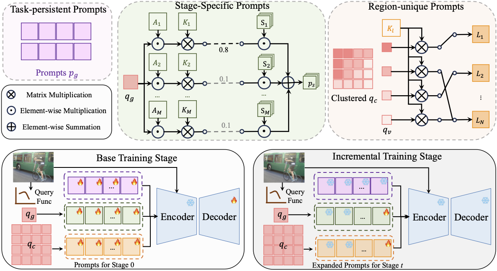

# MSVP
**[ICCV 2025]**Official PyTorch implementation of "Incremental Few-Shot Semantic Segmentation via Multi-Level Switchable Visual Prompts"

Please visit our [Official Website](https://gitee.com/VR_NAVE/msvp) if you are in Chinese Mainland.

## [\[Paper\]](https://github.com/WanMotion ) | [\[Arxiv\]](https://github.com/WanMotion ) | [\[Supplementary\]](https://github.com/WanMotion)

## :fire: Highlight
- **An innovative VLM-based and prompt-based IFSS framework**:We propose the first prompt-based IFSS framework, which introduces textual semantics and visual prompts to encode foreground and background classes separately, enabling incremental semantic segmentation.
- **Multi-level switchable visual prompts**: We propose multi-level switchable visual prompts that customizes multi-granular knowledge tailored to input images, enhancing the model's ability to learn novel classes while maintaining knowledge of old classes.
- **A new SOTA performance**: Extensive experiments demonstrate the effectiveness of the proposed method. Under the 1-shot condition, it achieves 49.1\% mIoU-N on VOC and 25.6\% mIoU-N on COCO, setting a new SOTA performance.

## :crown: Overview

Images are inputs into the query function to obtain global query features $q_g$ and pixel-wise query features $q_c$. Stage-specific prompts $p_s$ are generated by an attention-like integration way through $q_g$. Region-unique prompts $p_l$ are generated by nearest neighbor matching through clustered $q_c$. 
Image tokens, concatenated with these selected prompts, are input into pre-trained models to produce predictions. At incremental training stage, the model extends by fine-tuning novelly-added stage-specific prompts and region-unique prompts.

## :art: Code

Coming soon.
